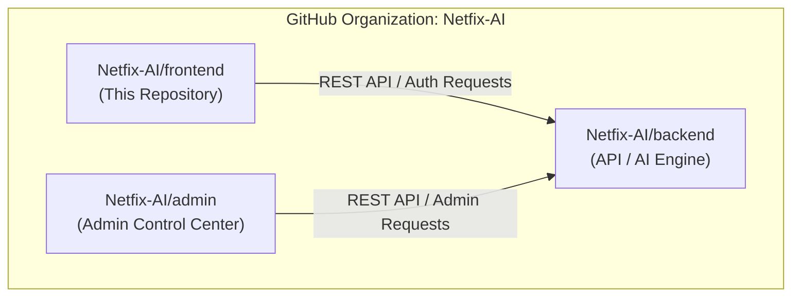
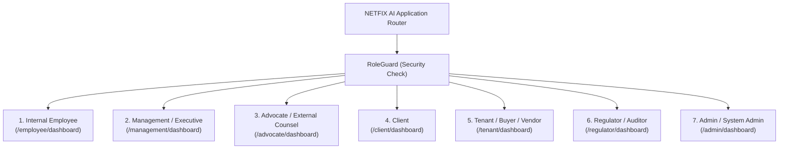
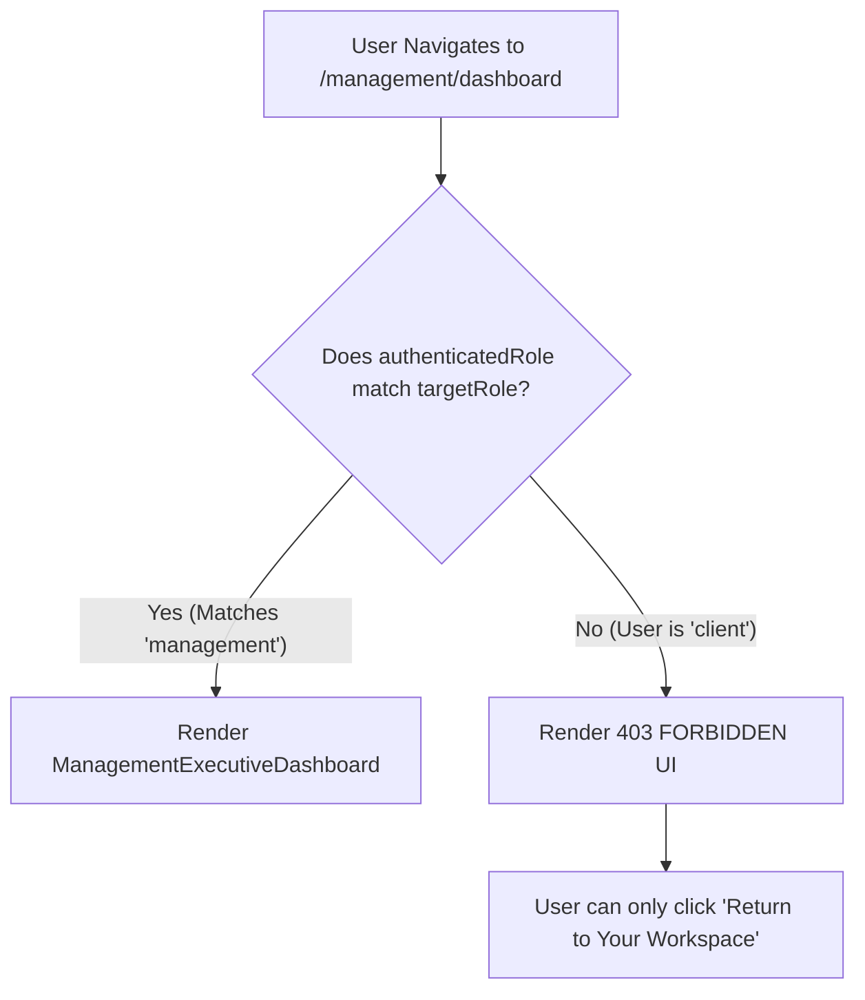
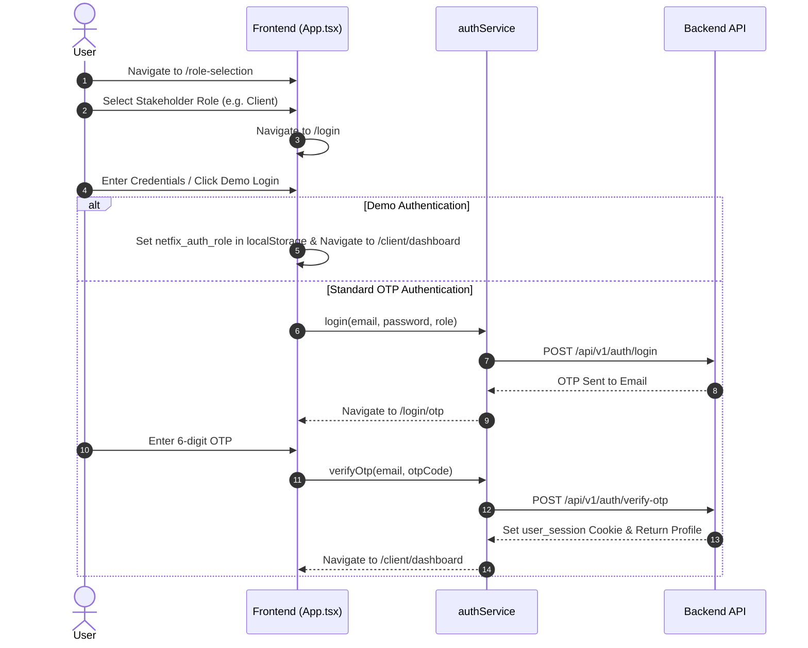

# NETFIX AI — Frontend

[](LICENSE)
[](https://react.dev/)
[](https://vitejs.dev/)
[](https://www.typescriptlang.org/)

The **NETFIX AI Frontend** is the user-facing web application for the NETFIX AI ecosystem (developed in association with MARG GROUP). It features a dark-themed enterprise landing page, multi-role authentication workflows, role-isolated dashboards for 6 core stakeholder roles, interactive Ask-AI agent assistants, and real-time AI processing telemetry.

---

## 📌 Repository Scope

> [!IMPORTANT]
> This repository contains **ONLY** the user-facing web application frontend.
>
> It does **not** contain the backend API or the system admin portal code.
>
> The corresponding components are maintained separately in isolated private repositories:
> - **Backend API & AI Engine**: [`Netfix-AI/backend`](https://github.com/Netfix-AI/backend)
> - **Admin Control Center**: [`Netfix-AI/admin`](https://github.com/Netfix-AI/admin)



---

## 🛠️ Technology Stack

- **Core Framework**: [React 19](https://react.dev/) (`react`, `react-dom`)
- **Build Tooling**: [Vite 6](https://vitejs.dev/) (`vite`, `@vitejs/plugin-react`)
- **Language**: [TypeScript 6](https://www.typescriptlang.org/) (`typescript`, `tsc`)
- **Styling**: [Tailwind CSS 3](https://tailwindcss.com/) (`tailwindcss`, `autoprefixer`, `postcss`)
- **Iconography**: [Lucide React](https://lucide.dev/) (`lucide-react`)
- **Linter**: [Oxlint](https://oxc.rs/docs/guide/usage/linter/rules) (`oxlint`)

---

## 📂 Project Structure

```
frontend/
├── public/
│   ├── ai_robot.png                # Brand AI hero illustration
│   ├── ai_robot_transparent.png    # Transparent robot graphic
│   ├── backend.mp4                 # Background ambient video
│   ├── favicon.svg                 # Application favicon
│   ├── hero-bg.jpg                 # Hero background wallpaper
│   ├── hero-reference.jpg          # Reference design asset
│   └── icons.svg                   # SVG icon definitions
├── src/
│   ├── assets/                     # Component images & brand SVGs
│   ├── components/
│   │   ├── auth/                   # Authentication & onboarding flow components
│   │   │   ├── AuthBackground.tsx
│   │   │   ├── AuthHeader.tsx
│   │   │   ├── LoginForm.tsx
│   │   │   ├── OTPVerification.tsx
│   │   │   ├── QuickGuideModal.tsx
│   │   │   ├── RegistrationForm.tsx
│   │   │   └── RoleSelection.tsx
│   │   ├── dashboard/              # Role-based dashboard workspaces & modules
│   │   │   ├── modules/            # Phase 1, 2, and 3 AI intelligence module widgets
│   │   │   ├── roles/              # 6 Core role dashboards + Admin view
│   │   │   │   ├── admin/
│   │   │   │   ├── advocate/
│   │   │   │   ├── auditor/
│   │   │   │   ├── client/
│   │   │   │   ├── employee/
│   │   │   │   ├── management/
│   │   │   │   ├── tenant/
│   │   │   │   ├── AdminDashboard.tsx
│   │   │   │   ├── AdvocateDashboard.tsx
│   │   │   │   ├── ClientDashboard.tsx
│   │   │   │   ├── InternalEmployeeDashboard.tsx
│   │   │   │   ├── ManagementExecutiveDashboard.tsx
│   │   │   │   ├── RegulatorAuditorDashboard.tsx
│   │   │   │   └── TenantDashboard.tsx
│   │   │   ├── shared/             # Reusable document, profile, and notification views
│   │   │   ├── LiveAgentActivity.tsx
│   │   │   ├── Phase1FoundationLayer.tsx
│   │   │   ├── Phase2DomainIntelligence.tsx
│   │   │   ├── Phase3AdvancedAnalysis.tsx
│   │   │   ├── RoleDashboard.tsx
│   │   │   ├── RoleDashboardContainer.tsx
│   │   │   ├── RoleDashboardShell.tsx
│   │   │   ├── RoleGuard.tsx       # Strict role boundary authorization wrapper
│   │   │   └── SecurityPanels.tsx
│   │   ├── About.tsx               # Landing page About section
│   │   ├── BrandLogo.tsx           # NETFIX AI brand logo component
│   │   ├── Contact.tsx             # Support contact component
│   │   ├── FAQ.tsx                 # Accordion FAQ component
│   │   ├── Footer.tsx              # Application footer
│   │   ├── Hero.tsx                # Landing hero banner component
│   │   ├── HowItWorks.tsx          # Workflow steps component
│   │   ├── Navbar.tsx              # Top navigation bar
│   │   ├── NetfixCard.tsx          # Card container component
│   │   ├── Roles.tsx               # Stakeholder roles feature grid
│   │   ├── RoleSelectionPlaceholder.tsx
│   │   └── VideoBackground.tsx     # Ambient video overlay wrapper
│   ├── data/
│   │   └── landingData.ts          # Static content, role definitions, FAQs
│   ├── services/
│   │   └── authService.ts          # Backend API client for login, register, OTP
│   ├── types/
│   │   └── index.ts                # TypeScript interfaces and data models
│   ├── App.css                     # Component styling overrides
│   ├── App.tsx                     # Main routing & application state engine
│   ├── index.css                   # Tailwind CSS directives & global dark theme
│   └── main.tsx                    # Application entry point DOM mount
├── .env.example                    # Safe environment template
├── .gitignore                      # Git exclusion rules
├── index.html                      # HTML entry document
├── package.json                    # Dependencies & scripts
├── postcss.config.js               # PostCSS pipeline config
├── tailwind.config.js              # Tailwind theme configuration
├── tsconfig.json                   # Root TypeScript config
├── tsconfig.app.json               # Application TypeScript compiler settings
├── tsconfig.node.json              # Node TypeScript compiler settings
└── vite.config.ts                  # Vite bundling & development server settings
```

---

## 📁 Folder-by-Folder Explanation

- **`src/components/auth/`**: Manages the complete onboarding and authentication workflow, including stakeholder role selection, credential entry, OTP verification, and modal guidance.
- **`src/components/dashboard/roles/`**: Contains the dedicated workspace views for all 6 stakeholder roles (`employee`, `management`, `advocate`, `client`, `tenant`, `regulator`) and `admin`.
- **`src/components/dashboard/modules/`**: Contains domain-specific AI intelligence widgets (e.g., GST reconciliation, contradiction analysis, RAG legal search).
- **`src/components/dashboard/shared/`**: Common views shared across role dashboards, such as profile settings, notification centers, and document viewers.
- **`src/services/`**: Encapsulates REST API calls to the backend API (`authService.ts`), managing login, demo logins, OTP verification, and profile updates.
- **`src/data/`**: Authoritative frontend dataset ([`landingData.ts`](file:///d:/TEJA%20PERSONAL/Nushift/Project%20M/Project/frontend/src/data/landingData.ts)) defining the 6 core roles, landing page FAQs, contact channels, and domain tags.

---

## 📄 Important Files

| File | Purpose | Used By | Responsibility |
|------|---------|---------|----------------|
| [`src/App.tsx`](file:///d:/TEJA%20PERSONAL/Nushift/Project%20M/Project/frontend/src/App.tsx) | Root Router & State Controller | `main.tsx` | Manages page routing (`pushState`), role authentication state, and renders auth/dashboard layouts |
| [`src/components/dashboard/RoleGuard.tsx`](file:///d:/TEJA%20PERSONAL/Nushift/Project%20M/Project/frontend/src/components/dashboard/RoleGuard.tsx) | Role Authorization Guard | `RoleDashboard.tsx` | Intercepts unauthorized cross-role routing attempts and renders a 403 Forbidden UI |
| [`src/components/dashboard/RoleDashboard.tsx`](file:///d:/TEJA%20PERSONAL/Nushift/Project%20M/Project/frontend/src/components/dashboard/RoleDashboard.tsx) | Role Workspace Host | `App.tsx` | Wraps active role dashboard views with top nav, sidebars, Ask-AI modals, and `RoleGuard` |
| [`src/services/authService.ts`](file:///d:/TEJA%20PERSONAL/Nushift/Project%20M/Project/frontend/src/services/authService.ts) | Authentication Service | Auth components | Communicates with `http://localhost:5000/api/v1/auth` for login, OTP, and session management |
| [`src/data/landingData.ts`](file:///d:/TEJA%20PERSONAL/Nushift/Project%20M/Project/frontend/src/data/landingData.ts) | Role & Content Data | Landing & Auth components | Defines official role structures, route paths, icons, workflow steps, and FAQs |
| [`src/components/dashboard/LiveAgentActivity.tsx`](file:///d:/TEJA%20PERSONAL/Nushift/Project%20M/Project/frontend/src/components/dashboard/LiveAgentActivity.tsx) | AI Agent Telemetry UI | Role Dashboards | Visualizes live AI agent execution steps, progress percentages, and current agent task state |

---

## 👥 Dashboard Architecture & Core Stakeholder Roles

The application supports **6 distinct stakeholder roles** (plus Admin overview), each tailored to specific operational requirements:



### Role Breakdown

#### 1. Internal Employee (`InternalEmployeeDashboard.tsx`)
- **Purpose**: Handles client cases, tax returns, document reviews, and AI-assisted task execution.
- **Accessible Views**: Case Overview, Facts & Chronology, Evidence, Contradictions, Citations, Legal Research, Draft Notices, Risk Analysis.
- **Key Actions**: Trigger AI agents (`doc_intake`, `case_analysis`, `tax_intelligence`), review AI outputs.

#### 2. Management / Executive (`ManagementExecutiveDashboard.tsx`)
- **Purpose**: High-level firm-wide oversight, financial compliance, strategic risk, and workload analytics.
- **Accessible Views**: Business Overview, Portfolio List, Approvals List, Risk Overview, Performance Analytics, Reports.
- **Restrictions**: Raw confidential document files are restricted unless explicitly granted by case owner.

#### 3. Advocate / External Counsel (`AdvocateDashboard.tsx`)
- **Purpose**: External legal counsel workspace for litigation matters, evidence analysis, and statutory research.
- **Accessible Views**: Assigned Matters Workspace, Legal Documents, Evidence Analysis, Legal Research (RAG), Deadlines, Drafts.
- **Key Actions**: Run `legal_research`, `citation_check`, `drafting`, and `adversarial` red-team stress testing.

#### 4. Client (`ClientDashboard.tsx`)
- **Purpose**: Corporate or individual client workspace to submit queries, track matter progress, and download reviewed reports.
- **Accessible Views**: Case Status Overview, My Matters, Shared Documents, Approvals, Requests, Messages, Ask-AI Modal.
- **Restrictions**: Cannot view internal employee notes, unverified AI drafts, or unassigned client records.

#### 5. Tenant / Buyer / Vendor (`TenantDashboard.tsx`)
- **Purpose**: Commercial property tenant, buyer, or vendor workspace for lease and project management.
- **Accessible Views**: Assigned Properties, Lease Agreements, Payment Dues, Maintenance Requests, Inquiries.
- **Key Actions**: View Unit B-302 lease terms, verify next payment due dates, submit property inquiries.

#### 6. Regulator / Auditor (`RegulatorAuditorDashboard.tsx`)
- **Purpose**: External auditor or compliance regulator workspace for evaluating assigned compliance records.
- **Accessible Views**: Assigned Reviews, Compliance Scorecard, Risk Controls, Open Findings, Audit Trail.
- **Restrictions**: Restricted strictly to assigned audit scopes (`AUD-001`, `AUD-002`, `AUD-003`).

---

## 🔒 Role Isolation & Security Boundaries

The frontend enforces strict role isolation via **[`RoleGuard.tsx`](file:///d:/TEJA%20PERSONAL/Nushift/Project%20M/Project/frontend/src/components/dashboard/RoleGuard.tsx)**:



When an authenticated user attempts to access a workspace outside their role:
1. `RoleGuard` intercepts the render pass.
2. It blocks the target component from mounting.
3. It displays an interactive **403 FORBIDDEN** screen showing the user's actual authenticated role and a button to return to their authorized workspace.

---

## 🔐 Authentication & Onboarding Workflow



---

## 🤖 AI Agent Activity UI & Telemetry

The frontend provides real-time visibility into AI agent executions through:

1. **`LiveAgentActivity.tsx`**: Displays active step progress indicators, progress percentages, and current task status for running agents.
2. **Role Ask-AI Modals**: Interactive modals (`ClientAskAiModal`, `EmployeeAskAiModal`, `AdvocateAskAiModal`) allowing users to invoke specific agents (`tax_intelligence`, `doc_intake`, `legal_research`).
3. **Task Status Polling**: Polls backend GET `/api/agent/tasks/:id` to update UI progress until completed.

---

## 🔑 Environment Variables

Create a local `.env` file based on `.env.example`:

```env
# Netfix AI Frontend API Endpoint
VITE_API_URL=http://localhost:5000/api/v1
```

---

## 🚀 Local Development Setup

### Prerequisites
- **Node.js**: `v18.0.0` or higher
- **npm**: `v9.0.0` or higher

### Installation & Execution

1. Navigate to the `frontend` folder:
   ```bash
   cd frontend
   ```

2. Install dependencies:
   ```bash
   npm install
   ```

3. Start the Vite development server:
   ```bash
   npm run dev
   ```
   The application will run at `http://localhost:3000` (or Vite assigned port).

---

## 🏗️ Build & Inspection Commands

| Command | Action | Description |
|---------|--------|-------------|
| `npm run dev` | Development Server | Starts Vite dev server with hot module replacement (HMR) |
| `npm run build` | Production Build | Executes TypeScript type check (`tsc -b`) and builds production bundle |
| `npm run lint` | Code Linter | Runs `oxlint` to check code quality and React hook safety |
| `npm run preview` | Preview Build | Serves compiled `dist/` bundle locally for testing |

---

## 🛡️ Security Notes

- **Client-Side Authorization**: `RoleGuard` prevents unauthorized UI rendering, but all data access is authoritatively validated by backend RBAC policies.
- **Session Tokens**: Handled via `HttpOnly` backend cookies; no sensitive JWT tokens are stored in `localStorage`.
