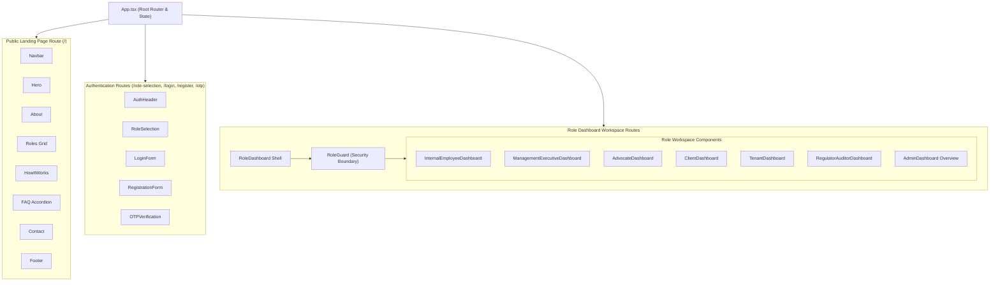
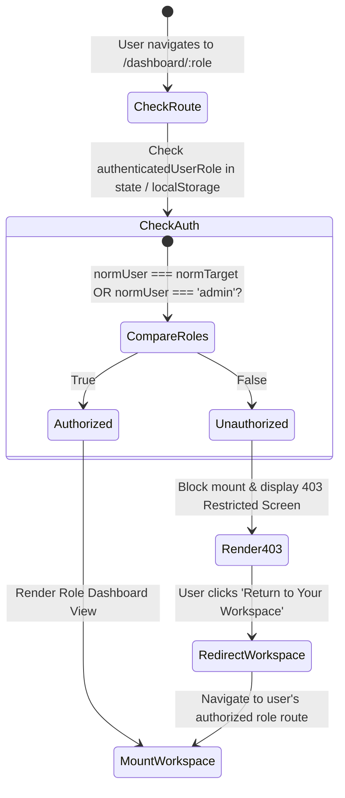
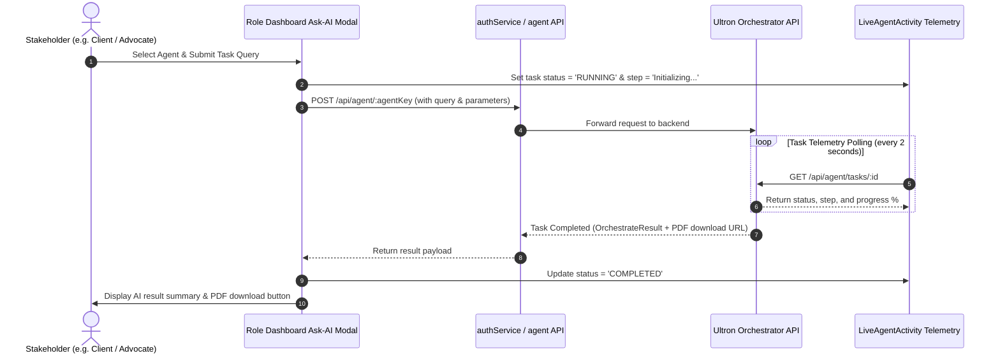

# NETFIX AI — Frontend Architecture & Role Workspace Specifications

This document details the layout architecture, component hierarchy, role guard authorization flow, and AI agent modal integration in the **NETFIX AI Frontend**.

---

## 🏛️ Component Architecture & Layout Tree

---

## 🛡️ RoleGuard Security Decision Flow

---

## 🤖 Interactive Ask-AI Modal Data Flow

